# North American Rig Count Change Predictor

COVID-19 has changed the world as we know it in a permanent way. With countries around the world shutting massive metropolitan areas down, while workplaces are promoting remote work, everyone is trying to do their part to help contain the spread of the virus. Though many see these restrictions as necessary, they have crippled many parts of the economy, especially the service industries as would-be consumers stay home instead of venture out of their homes for daily commutes, work lunches, or date nights. 

With so many people staying at home and not using their vehicles, worldwide demand for consumption of oil has crashed with oil commodity prices following suit. 

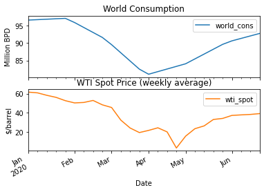

This commodity price crash has created a crisis across the oil industry; operations that were profitable at \\$60 were no longer profitable at sub \\$20 prices. During its recent peak in 2018, the oil and gas industry supported nearly 10.3 million jobs and added nearly 8% of the nation’s GDP [1]. As a result, the US has been specifically hit hard by this price crash. The exploration and production companies (E&P’s) could no longer afford to continue to drill and in turn the companies that had been providing services to the E&Ps could no longer afford to keep staff and layoffs began. The upstream oil and gas industry in have lost 107,000 of its workforce due to the layoffs in 2020 [2]. 

The Baker Hughes Rig Count has been used as an industry standard to track upstream activity in the mainland US (also known as the US L48, not including Alaska, or Hawaii). The severity of this activity in the US can be shown by looking at the previous seven months of data.

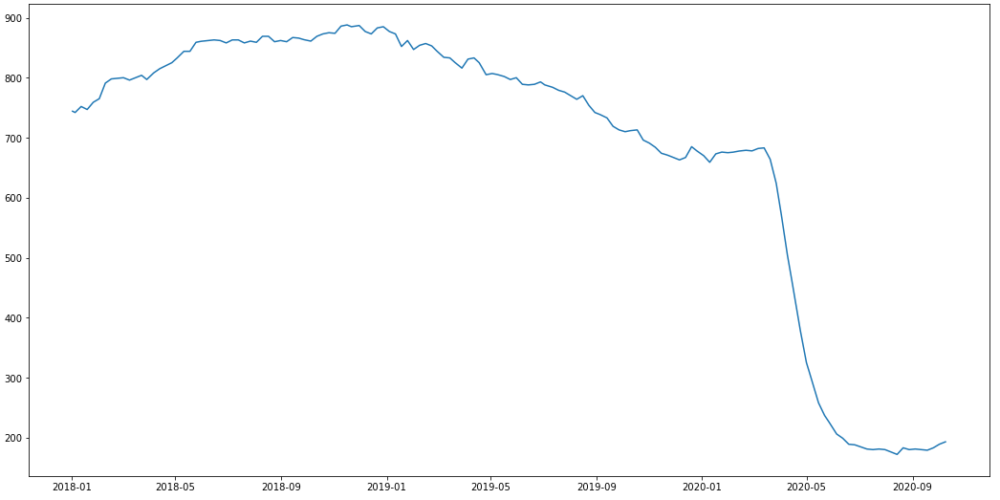

However, it’s not all doom and gloom for the US oil and gas industry. As the lockouts in many countries begin to lift, demand for oil will increase with more drivers on the road. The EIA is expecting demand for oil to rebound close to 2019 levels in 2021 [3]. With the price of oil improving to around $40 barrel, the rig count has yet to reflect the same increase. 

This leads to the following questions : when will the upstream industry begin a recovery in activity, and what factors influence it the most? Being able to predict the recovery could allow companies to get a head start on increasing staffing and investment levels to be able to take advantage of increased activity levels when other competitors are still on the upswing. Several factors will be analysed including worldwide and regional supply, demand and storage, OPEC spare capacity, oil prices, and oil futures trading, among others to predict the change of the US rig count in the future.

## 1 Project Objective

The project objective is to add as much value to the client while maximising accuracy of the model as well. There are two different ways to complete this with machine learning - regression or classification.

## 1.1 Regression

Regression involves predicting the discrete (numerical) value of the rig count. As this problem is time based, in this example n, the predicted value of rig count (t+1) is dependent on the value of rig count (t). These type of time based regression models are typically used in economic forecasting and are well suited to the problem stated above.

Multi variate time based analyses can often be complex and require significantly more computing power by using methods such as neural networks or other deep learning models to achieve high levels of accuracy. 

## 1.2 Classification

A classification model approaches the situation differently; instead of predicting a single discrete value, it predicts whether or not the discrete value (t + 1) fits in a range of values (here, bins). Specifically in this project, the model will predict the percent change of the rig count between two points in time. The bins could be similar to the following : 
* (inf, -5%]
* (-5%, 0%]
* (0, 5%]
* (5%, inf)

Though the precision of the prediction is not as great as predicting an individual discrete value using a regression model, we can improve the value of the model by increasing prediction accuracy, and by making predictions farther into the future (t + n, where n > 1).

Due to the issues identified above with the regression models, I pursued the classification model in order to be able to improve overall model accuracy and produce a deliverable that will provide the client the most value.

## 2 Data Wrangling

The data can be divided into two categories, the rig count data, and economic data.

### 2.1 Rig Count Data

#### 2.1.1 Data Pulling

[Rig Count Data Notebook](https://github.com/brspencer90/rig-count_L48/blob/master/notebooks/02_Classification/2.1_Mining-Cleaning_BHRigCount_weekly.ipynb)

The rig count data is sourced from the Baker Hughes Rig Count website. Baker Hughes has been long recognized as the world standard for rig count data, and is given weekly. Specifically, we will only be using oil rig count in the US L48.

[Baker Hughes Rig Count](https://rigcount.bakerhughes.com/)

#### 2.1.2 Data Cleaning

With data being released weekly, having to download the excel file manually and pulling data would be too time intensive and inefficient. As such, the file link is located using BeautifulSoup and set up a script to download the file directly. The oil rig data then needs to be split from the gas rig data and analysed separately.

### 2.2 Economic Data

#### 2.2.1 Data Pulling

[EIA Economic Data Notebook](https://github.com/brspencer90/rig-count_L48/blob/master/notebooks/02_Classification/2.2_Mining-Cleaning_EIAData_weekly.ipynb)

The economic data is sourced from the Energy Information Administration, a US government organisation that collects a vast amount of data and supplies analysis and reports based on this information. They have an extensive API that is used for this project to obtain data including commodity prices, production data, and consumption data. This data ranges from daily to monthly.

[EIA API Access](https://www.eia.gov/opendata/)

#### 2.2.2 Data Cleaning

The main issue with this data from the EIA is the fact that the data does not have a consistent frequency. In order to match with the oil rig data the daily data was averaged to weekly data, while the monthly data was interpolated to weekly data. In addition, the units were not consistent between the different features, and were all normalized to million barrels (Mbbl).

## 3 Exploratory Data Analysis

[EDA Notebook](https://github.com/brspencer90/rig-count_L48/blob/master/notebooks/02_Classification/3.1_EDA_class.ipynb)
 
### 3.1 Describe the data obtained in a visual and tabular method

Rig count is not a stationary or seasonal variable. There are two major inflection points correlating to two oil crashes in 2014 and 2020. Why did these happen?

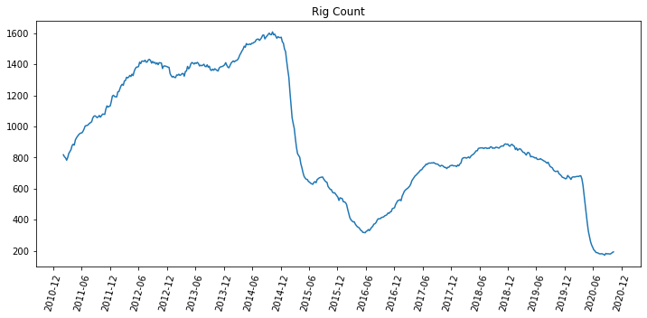

### 3.2 Identify features with high correlation to the target variable (rig count)

After plotting the oil price (WTI or West Texas Intermediate) against the rig count, the close relationship between rig count and oil price is apparent, however it doesn't match very well in recent months.

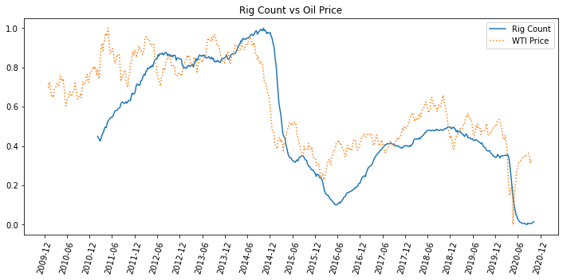

Using a large correlation table shows the correlation values between features and the highlighted Rig Count. There are a number of features that show high levels of positive and negative correlations, this will help to counter the strong price correlation where the values don't match.

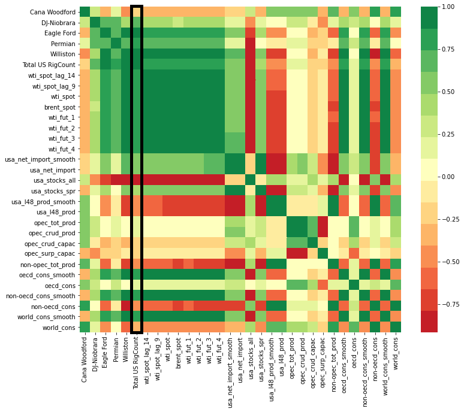

### 3.3 Create the classification bins and identify the future prediction time target 

To add better value to the project the choice was made to predict the rig count four, and eight weeks into the future. The accuracy of each will be analysed in the next section.

The distribution of the percent changes across all time indeces are shown below. The distribution is almost normal with a tail to the left.

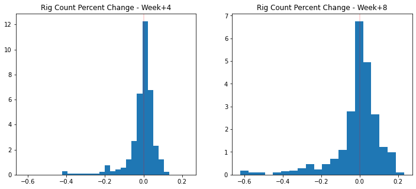

The classification bins can be set up based on quarterly percentiles (0-25%, 25-50%, 50-75%, 75-100%). 

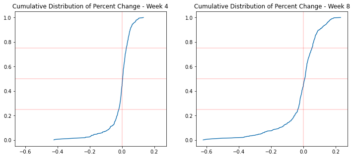

In order to keep this consistent between four and eight week predictions, we can split these classes into positive and negative changes (+, -), and split these further to show significant positive or negative changes (++, --).

## 4 Modelling & Machine Learning

I chose to do the majority of the modelling using the Scikit learn library with a few custom functions to help automate the process. The notebook for the modelling can be found here : 

[Modelling Notebook](https://github.com/brspencer90/rig-count_L48/blob/master/notebooks/02_Classification/5.1_Modelling_class.ipynb)

### 4.1 Train / Test Split

The data is split using Scikit Learn's train_test_split method. A random seed was chosen to make sure the data is consistent while training the models. The test size is set to 0.33 and the distribution of the train and test split can be seen below : 

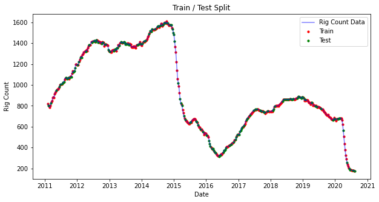

### 4.2 Scoring metrics

For multi-label classification data, there are a number of different scoring metrics to use. Accuracy, precision, and recall are the major scoring metrics that show overall correct prediction, and proper class prediction; however, there is another metric we will use in this project, and make it a priority to maximise.

As mentioned before, the classes are distributed between a significant decrease (--), slight decrease (-), slight increase (+), and significant increase (++). None of these classes are more important than the other, however the largest loss in value will happen if the positives are misclassified as a negative. As such we will use this positive / negative class accuracy as primary scoring metric.

Example Confusion Matrix : 
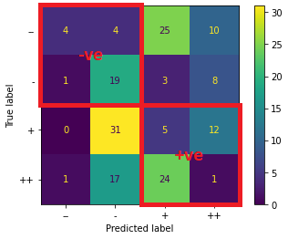

The positive negative class accuracy is defined as the percent of values located in the top left and bottom right quadrants of the confusion matrix (where predicted labels and true labels match for negative and positive changes, respectively).

### 4.3 Model selection

#### 4.3.1 Baseline performance

Before beginning to choose and optimise models, a baseline must first be established to gauge performance. There are two options here : 
* Assume random choice (25% accuracy for individual classes or 50% for positive / negative classes)
* Use a dummy classifier using the optimal number of features

We will use both baselines to measure performance of the model at the end of the analysis. The dummy classifier baseline model is shown below : 

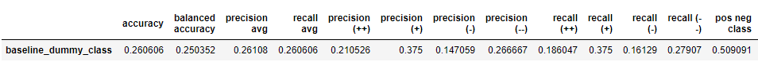

As shown here the model performance is just better than random choice in the average scoring metrics. 

#### 4.3.2 KMeans Clustering

This is a simple model that graphically groups the data based on k number clusters (here k = 4). Though this is not expected to perform very well, it gives us a simple idea of how the data lies in a multidimensional space.

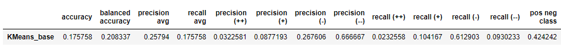

As expected the performance is very poor in nearly all metrics and is worse than random choice. 

#### 4.3.3 Random Forest Classification

Three random forest classifications were run and optimised including a baseline version. Two other scoring metrics (positive negative class accuracy, and recall for (-) class) were used and optimised using scikit-learn's GridSearchCV. The performance of the models are listed below : 

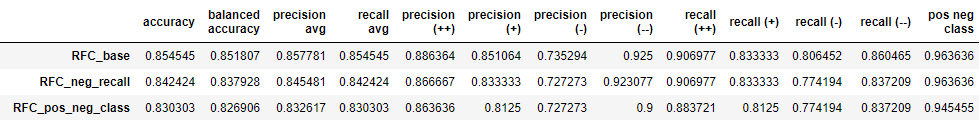

The performance of these models are very good with positive negative class accuracy greater than 94%, and average recall and precision greater than 83%. As the base model performs the best compared to the optimised models, that is the choice coming out of the Random Forest Classifiers.

#### 4.3.4 XGBoost Classifiers

The XGBoost classifier is run with the same methods as the Random Forest classifiers. Three models were run including two that were optimised by GridSearchCV.

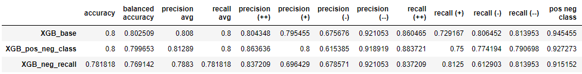

The performance of these models were not as good as the Random Forest Classifiers; however, it is interesting to note that the model was much less complex. XGBoost optimised max depth was 2, whereas the Random Forest max depths were 8.

### 4.4 Final model choice

All models are listed in the table below, sorted by positive negative class accuracy.

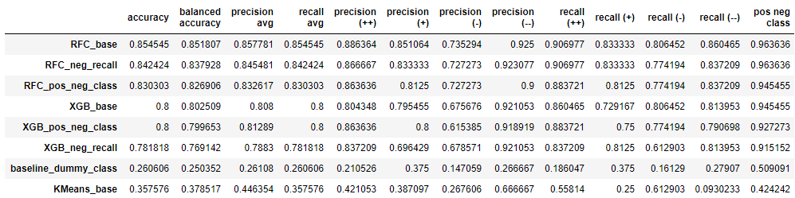

As shown here the Random Forest out of the box model performed best to be able to correctly predict the percent change of rig count eight weeks into the future.

The model performs significantly better than the baseline random choice, and dummy classifier models, and marginally better than the other optimised models in all scoring metrics.

## 5 Future Improvements

* **Increasing the amount of bins.** Four bins is fine, but the range for the significant changes (++, --) is quite large, especially for the predictions eight weeks into the future. Being able to be more specific helps increase value of this product.

* **Additional features or feature engineering.** I'd like to be able to include breakeven prices for oil, per basin if possible, to be able to add more value for commercial clients in planning personnel and equipment to reflect future operational planning in specific locations. Additional feature engineering may be required to increase accuracy if number of bins are increased as well.

* **Revisit regression prediction model.** I'd like to be able to produce a "sexier" and more visually attractive project. The one issue with a classification based project is it is harder to visualize for time series data. 

* **Have a visual / interactive portion for model analysis.** As mentioned, not having a visual or interactive way to use the model isn't great for marketing. A simple dashboard would be an easy way to get results from the model without having to run or edit Jupyter notebooks.

Citations :

[1] API. “OIL &amp; NATURAL GAS: SUPPORTING THE ECONOMY, CREATING JOBS, DRIVING AMERICA FORWARD,” 2018. https://www.api.org/~/media/Files/Policy/Taxes/DM2018-086_API_Fair_Share_OnePager_FIN3.pdf.

[2] Takahashi, Paul. “US oil and gas industry lost 107,000 jobs in the pandemic. Most will take years to return.,” Oct 9, 2020. https://www.houstonchronicle.com/business/energy/article/U-S-oil-and-gas-industry-lost-107-000-jobs-in-15633468.php.

[3] EIA. “U.S. Energy Information Administration - EIA - Independent Statistics and Analysis,” 2020. https://www.eia.gov/outlooks/steo/data.php.

